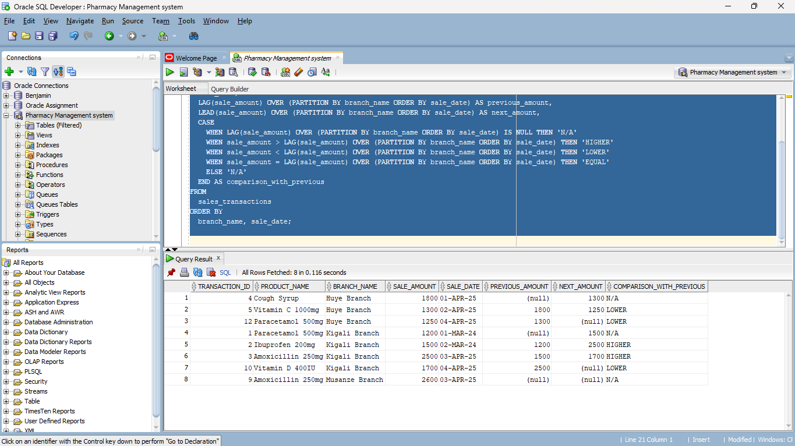

 @@@commitment-issue
Exploring SQL Window Functions 
 💊 Exploring SQL Window Functions — Pharmacy Management System

👥 Group Members
- Student 1: [FATHIRI Benjamin 27393]
- Student 2: [NTWARI Emery 27276 ]

 🤪 Repository Name
Funny name: `commitment-issue`

 📚Project Description
In this project, we explored powerful SQL Window Functions using a pharmacy sales dataset. The goal was to analyze sales trends, identify top-selling medicines, and understand customer purchasing patterns using advanced SQL techniques like LAG(), LEAD(), RANK(), DENSE_RANK(), ROW_NUMBER(), and window-based aggregations.

We worked with a fictional table called `sales_transactions`, containing medicine sales records from different branches in April 2025.

 🧾 Dataset: sales_transactions

 Column         = Description                        

 transaction_id = Unique ID for each sale            
 product_name   = Name of the medicine               
 category       = Medicine category (e.g. Pain Relief, Supplements) 
 branch_name    = Branch where sale occurred         
 sale_amount    = Price of the sale in RWF           
 sale_date      = Date of the transaction            

🧪Task 1: Compare Values with Previous or Next Records

We used `LAG()` and `LEAD()` functions to compare each transaction's sale amount with the previous one (in the same branch).

We also used a `CASE` statement to label whether the sale amount was HIGHER, LOWER, or EQUAL to the previous.

🎯 Real-Life Use: This helps identify sudden changes in product sales — useful for detecting popular vs. declining products in a branch.

🏅Task 2: Ranking Sales within a Category

We applied both `RANK()` and `DENSE_RANK()` to rank products by sale amount within each category.

- `RANK()`  skips positions when values tie.
- `DENSE_RANK()`  gives sequential ranks even when values tie.

🎯 Real-Life Use: Pharmacy managers can use this to identify top-selling medicine per category and plan promotions or restocking.

🥇Task 3: Top 3 Records per Category.

We used `ROW_NUMBER()` to get the top 3 best-selling products in each category.

🎯 Real-Life Use: Helps identify best-performing products per medicine group, useful for sales reporting and reward-based systems.

🕰Task 4: First 2 Records per Category by Date.

Using `ROW_NUMBER()` ordered by `sale_date`, we retrieved the first two transactions per category.

🎯 Real-Life Use: This helps track product launch performance or discover how quickly new items are sold across branches.

📈Task 5: Aggregation with Window Functions.

We used the `MAX()` function with and without `PARTITION BY`:

- MAX(sale_amount) OVER (PARTITION BY category) → Max sale per category
- MAX(sale_amount) OVER () → Overall highest sale in the dataset

🎯Real-Life Use: Easily compare each product's sale with the highest in its category or overall. Useful for ranking, benchmarking,and KPI reports.

✅  Conclusion

This assignment helped us practice SQL window functions in a real-world pharmacy context. We improved our skills in writing analytical queries and gained a deeper understanding of how databases can support business decisions, we are glad to have a certain task like this.

